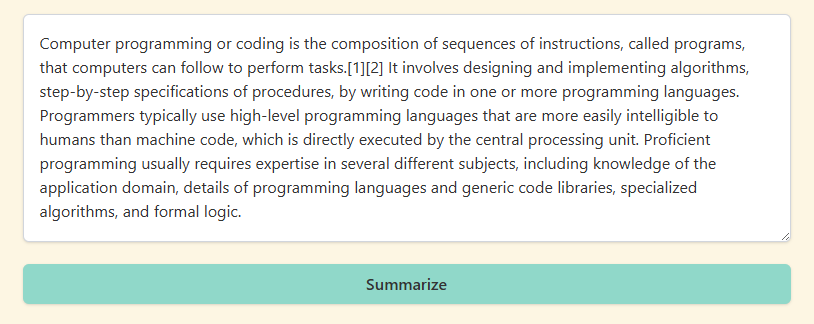
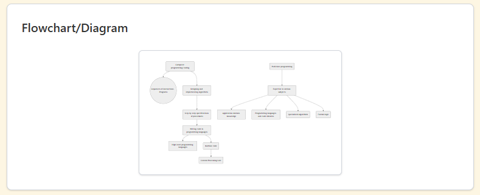
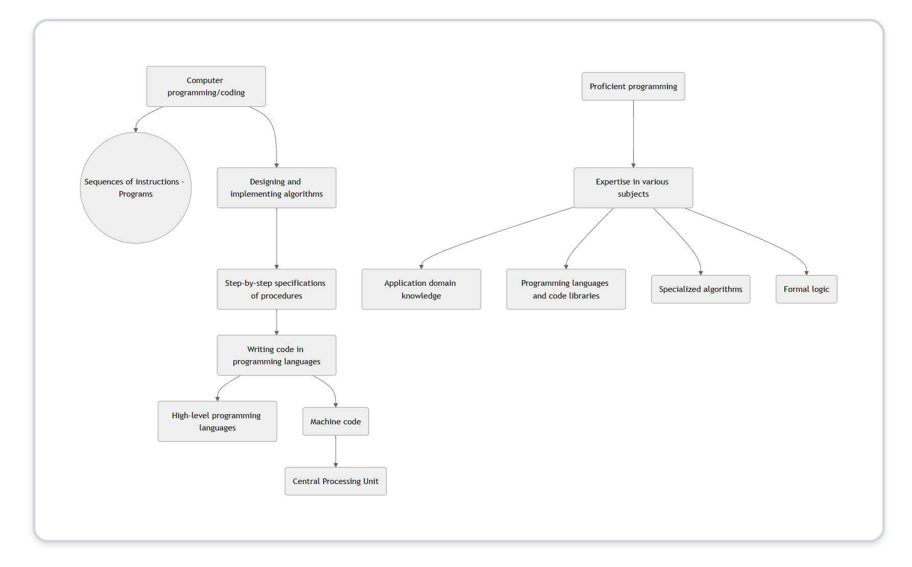
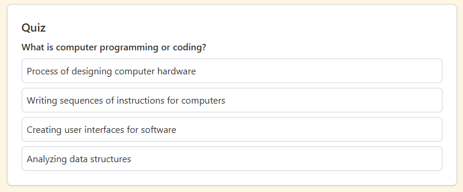

# What Did I Just Read? – AI Reader's Learning Assistant

**“What Did I Just Read?”** is a learning assistant designed for diverse learners who struggle with traditional reading. It helps users process dense academic or informational text by instantly transforming it into **casual summaries** and **flowchart-style visualizations** through the power of AI.

This project is designed to be a demonstration of modern LLM workflows, multimodal output design, and accessibility-focused UX, with the potential to grow into a fully-featured educational tool.

## Problem & Purpose

People with learning disabilities, ADHD, or other nerodiverse conditions often find themselves re-reading the same paragraph multiple times, zoning out, or struggling to absorb written content presented in rigid formats. This tool solves that by:

- Rewriting dense material into **approachable summaries**
- Generating **visual diagrams** of key concepts
- Optionally offering **audio playback** for auditory learners
- Storing sessions in a simple **user dashboard**

## Features (MVP)

| Feature                 | Status  | Description                                                                 |
|------------------------|---------|-----------------------------------------------------------------------------|
| Casual Summary       | COMPLETE | Uses GPT-3.5 to rewrite text in relaxed, accessible language               |
| Visual Diagram (Flowchart) | COMPLETE | Converts key ideas into Mermaid.js diagrams                                |
| TTS      | COMPLETE | Optional playback of summaries using free browser-based TTS      |
| Quiz        | COMPLETE | Quiz for comprehension checks for what you just read                                 |
| User Accounts        | Planned | Firebase Auth for email-based login/signup                                 |
| Session Storage      | Planned | Saves summaries + diagrams per user in Firestore for review later          |

## Tech Stack & Design Justifications

| Layer        | Tech                          | Reasoning                                                                 |
|--------------|-------------------------------|---------------------------------------------------------------------------|
| **Frontend** | React + Tailwind CSS          | React offers flexibility; Tailwind enables clean UI with low friction     |
| **Backend**  | Node.js + Express             | Easy integration with React; popular for web APIs                         |
| **LLM**      | OpenAI GPT-3.5 | GPT-3.5 is low-cost, powerful; GPT-4 can be swapped in if needed         |
| **Visuals**  | Mermaid.js                    | Renders flowcharts in-browser from text-based syntax                      |
| **TTS**      | Web Speech API | Free and runs natively in browser, easy to implement                     |
| **Auth**     | Firebase Auth                 | Easy user management + optional social login support                      |
| **Storage**  | Firebase Firestore            | Fast, serverless NoSQL DB for storing sessions per user                  |
| **Deployment** | Vercel (Frontend) + Render or Railway (Backend) | Simple to set up and scalable for small projects                       |

## Example Flow

1. User logs in and pastes a dense block of text. (PLANNED)
2. App sends the input to the backend.
3. Backend uses GPT-3.5 to:
   - Generate a casual TL;DR summary
   - Extract key relationships for diagram
   - Generate quiz questions
4. Casual summary is displayed.
5. Mermaid.js renders the diagram in-browser.
6. Quiz is generated.
7. Session is stored and accessible from the user’s dashboard. (PLANNED)

## Example Input & Output

### Input:
"Computer programming or coding is the composition of sequences of instructions, called programs, that computers can follow to perform tasks. It involves designing and implementing algorithms, step-by-step specifications of procedures, by writing code in one or more programming languages. Programmers typically use high-level programming languages that are more easily intelligible to humans than machine code, which is directly executed by the central processing unit. Proficient programming usually requires expertise in several different subjects, including knowledge of the application domain, details of programming languages and generic code libraries, specialized algorithms, and formal logic."

### Outputs (Thus Far)

#### Summary

#### Diagram

To Do: Render the flowchart zoomed in more so it can be visible within the outlined confines.

#### Audio Clip
Button beneath generated summary allows you to play text-to-speech.

#### Quiz

## Status
Currently developing and out of the planning phase! Have implemented several features already. What's next is the homepage UI and signup/login features.

## Future Directions

- Let users customize how content is explained (e.g., story, metaphor, step-by-step)  
- Upload PDFs or slides and summarize sections in bulk  
- Chrome extension for summarizing web content instantly  
- Swap in Claude, Mistral, or open-source models using a pluggable architecture 

## Contributing

This is an open project! If you have feedback, suggestions, or want to collaborate on UX or accessibility improvements, feel free to open an issue or PR.

## Inspiration

Inspired by my own struggles with finding learning solutions that work for me and the amazing learning experience offered by tools like [Brilliant.org](https://brilliant.org). This project aims to make learning feel rewarding and accessible, not exhausting.

## About the Author

Built by Jazmin Tweedle, a Software Engineer & AI Enthusiast. Jazmin got her start from a coding bootcamp at Northwestern, then worked at her first full-time SWE role at Google through their apprenticeship program. She's now looking for a full-time role post-apprenticeship where she can create great user experiences.
